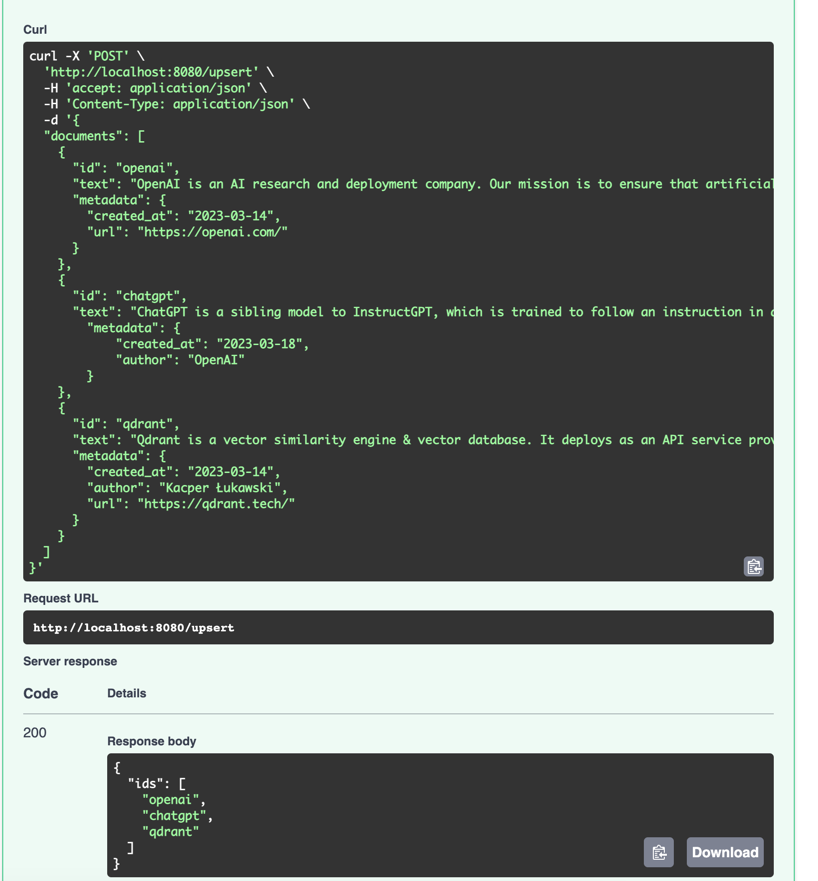

# play-chatgpt-retrieval-plugin

## SetUp

```bash
cd chatgpt-retrieval-plugin/examples/docker/qdrant/

export OPENAI_API_KEY=<your OpenAI API key>

docker compose up -d
```


## API Requests

FYI: `localhost:8080/docs`

### /upsert

```bash

curl -X 'POST' \
  'http://localhost:8080/upsert' \
  -H 'accept: application/json' \
  -H 'Content-Type: application/json' \
  -d '{
  "documents": [
    {
      "id": "openai",
      "text": "OpenAI is an AI research and deployment company. Our mission is to ensure that artificial general intelligence benefits all of humanity.",
      "metadata": {
        "created_at": "2023-03-14",
        "url": "https://openai.com/"
      }
    },
    {
      "id": "chatgpt",
      "text": "ChatGPT is a sibling model to InstructGPT, which is trained to follow an instruction in a prompt and provide a detailed response. The dialogue format makes it possible for ChatGPT to answer followup questions, admit its mistakes, challenge incorrect premises, and reject inappropriate requests.",
        "metadata": {
            "created_at": "2023-03-18",
            "author": "OpenAI",
            "url": "https://chatgpt.com/"
        }
    },
    {
      "id": "qdrant",
      "text": "Qdrant is a vector similarity engine & vector database. It deploys as an API service providing search for the nearest high-dimensional vectors. With Qdrant, embeddings or neural network encoders can be turned into full-fledged applications for matching, searching, recommending, and much more!",
      "metadata": {
        "created_at": "2023-03-14",
        "author": "Kacper Łukawski",
        "url": "https://qdrant.tech/"
      }
    }
  ]
}'
```


### /query

```bash
curl -X 'POST' \
  'http://localhost:8080/query' \
  -H 'accept: application/json' \
  -H 'Content-Type: application/json' \
  -d '{
  "queries": [
    {
      "query": "test query",
      "top_k": 3
    }
  ]
}'
```


### /query-and-ask

```bash
curl -X 'POST' \
  'http://localhost:8080/query-and-ask' \
  -H 'accept: application/json' \
  -H 'Content-Type: application/json' \
  -d '{
  "queries": [
    {
      "query": "what is chatgpt",
      "top_k": 3
    }
  ]
}'
```


